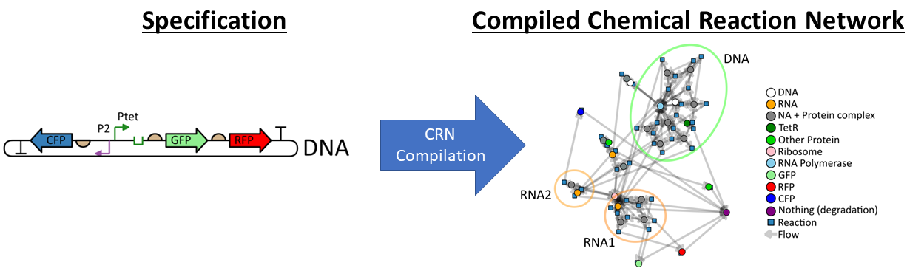

# BioCRNPyler &mdash; Biomolecular Chemical Reaction Network Compiler
## Python toolbox to create CRN models in SBML for biomolecular mechanisms

[](https://travis-ci.com/BuildACell/BioCRNPyler)
[](https://codecov.io/gh/BuildACell/BioCRNPyler)
[](https://badge.fury.io/py/biocrnpyler)
[](https://mybinder.org/v2/gh/BuildACell/BioCRNPyler/master?filepath=%2Fexamples%2F)

BioCRNPyler (pronounced Bio-Compiler) is a Python package for the creation, manipulation,
and study of the structure, dynamics, and functions
of complex biochemical networks.

- **Website:** http://buildacell.io/BioCRNPyler
- **Source:** https://github.com/BuildACell/BioCRNPyler
- **Paper:** - [BioCRNpyler: Compiling Chemical Reaction Networks from Biomolecular Parts in Diverse Contexts](https://www.biorxiv.org/content/10.1101/2020.08.02.233478v1)
- **Mailing list:** [SBTools Google Group](https://groups.google.com/g/sbtools/) Email: sbtools@googlegroups.com
- **Bug reports:** https://github.com/BuildACell/BioCRNPyler/issues
- **Documentation** Coming Soon! Check out the [website](http://buildacell.io/BioCRNPyler) and [source code](https://github.com/BuildACell/BioCRNPyler) until then.
- **Slack** Join the #biocrnpyler channel on SBTools slack: Ask on the public SBTools Google group to be added or send a message to one of the maintainers. 

# Example 1: Building Simple CRNs by Hand

BioCRNpyler allows for CRNs to be built by hand, adding Species and Reactions manually.

```python
from biocrnpyler import *
# let's build the following CRN
# A -->[k1] 2B
# B -->[k2] B+D
# Species
A = Species("A")
B = Species("B")
C = Species("C")
D = Species("D")

#Reaction Rates
k1 = 3.
k2 = 1.4

#Reaciton Objects
R1 = Reaction.from_massaction([A], [B, B], k_forward = k1)
R2 = Reaction.from_massaction([B], [C, D], k_forward = k2)

#Make a CRN
CRN = ChemicalReactionNetwork(species = [A, B, C, D], reactions = [R1, R2])
print(CRN)
```

# Example 2: Compiling Complex CRNs from Specifications

BioCRNpyler also allows for higher level descriptions to be compiled into a CRN. In the below example, a piece of synthetic DNA with two promoters pointing in opposite directions is constructed from a list of DNAparts which are combined together in a DNA_construct and then simulated in a TxTlExtract context, which represents a cell-free bacterial lysate with machinery like Ribosomes and Polymerases modeled explicitly.



```python
from biocrnpyler import *

#Define a set of DNA parts
ptet = RegulatedPromoter("ptet",["tetr"],leak=True) #this is a promoter repressed by tetR and has a leak reaction
pconst = Promoter("pconst") #constitutive promoter
pcomb = CombinatorialPromoter("pcomb",["arac","laci"], leak=False, tx_capable_list = [["arac"], ["laci"]]) #the Combinations A and B or just A or just B be transcribed
utr1 = RBS("UTR1") #regular RBS
utr2 = RBS("UTR1") #regular RBS
gfp = CDS("GFP","GFP") #a CDS has a name and a protein name. so this one is called GFP and the protein is also called GFP
fusrfp = CDS("fusRFP","RFP",no_stop_codons=["forward"]) #you can say that a protein has no stop codon. This is a little different from a fusion protein, because in this case you are saying that the ribosome reads through two proteins but still produces two distinct proteins, rather than one fused protein. This can happen in the case of the ta peptide which causes a peptide bond not to be formed while making a protein.
rfp = CDS("RFP","RFP") #regular RFP
cfp = CDS("CFP","CFP") #cfp
t16 = Terminator("t16") #a terminator stops transcription

#Combine the parts together in a DNA_construct with their directions
construct = DNA_construct([[ptet,"forward"],[utr1,"forward"],[gfp,"forward"],[t16,"forward"],[t16,"reverse"],[rfp,"reverse"],[utr1,"reverse"],[pconst,"reverse"]])

#some very basic parameters are defined - these are sufficient for the whole model to compile!
parameters={"cooperativity":2,"kb":100, "ku":10, "ktx":.05, "ktl":.2, "kdeg":2,"kint":.05}

#Place the construct in a context (TxTlExtract models a bacterial lysate with machinery like Ribosomes and Polymerases modelled explicitly)
myMixture = TxTlExtract(name = "txtl", parameters = parameters, components = [construct])

#Compile the CRN
myCRN = myMixture.compile_crn()

#plotting not shown - but BioCRNpyler automatically produces interactive reaction network graphs to help visualize and debug complex CRNs!
```


More advanced examples can be found in the [example](https://github.com/BuildACell/BioCRNPyler/tree/master/examples) folder, 
here's the first file in the Tutorial series: [Building CRNs](https://github.com/BuildACell/BioCRNPyler/blob/master/examples/1.%20Building%20CRNs%20Directly.ipynb)

# Installation


Install the latest version of BioCRNPyler::

    $ pip install biocrnpyler

Install with all optional dependencies::

    $ pip install biocrnpyler[all]

Further details about the installation process can be found in the [BioCRNPyler wiki](https://github.com/BuildACell/BioCRNPyler/wiki#installation).

# Bugs

Please report any bugs that you find [here](https://github.com/BuildACell/BioCRNPyler/issues).
Or, even better, fork the repository on [GitHub](https://github.com/BuildACell/BioCRNPyler),
and create a pull request (PR). We welcome all changes, big or small, and we
will help you make the PR if you are new to `git` (just ask on the issue and/or
see [contribution guidelines](https://github.com/BuildACell/BioCRNPyler/blob/master/docs/CONTRIBUTING.md)).

# Versions

BioCRNpyler versions:

* 1.0.0 (latest stable release): To install run `pip install biocrnpyler` 
* 0.9.0 (beta release): To install run `pip install biocrnpyler==0.9.0`
* 0.2.1 (alpha release): To install run `pip install biocrnpyler==0.2.1`

# License
Released under the BSD 3-Clause License (see `LICENSE`)

Copyright (c) 2020, Build-A-Cell. All rights reserved.

