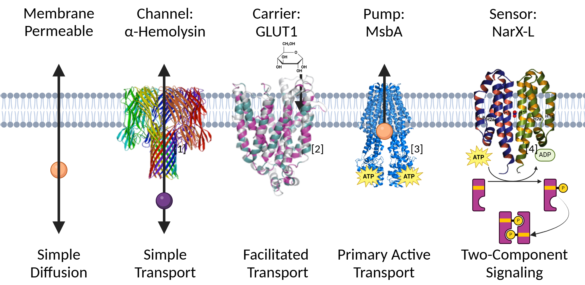
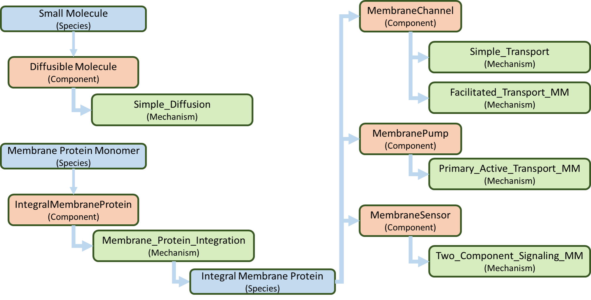
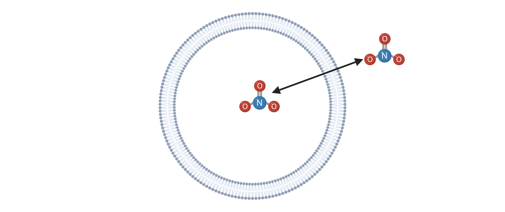
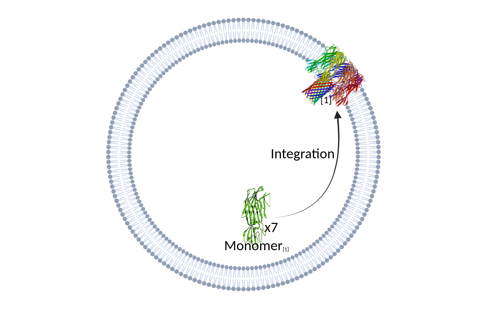
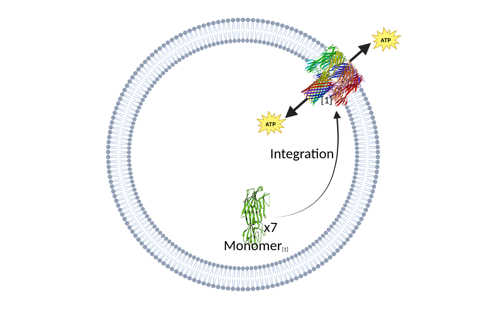
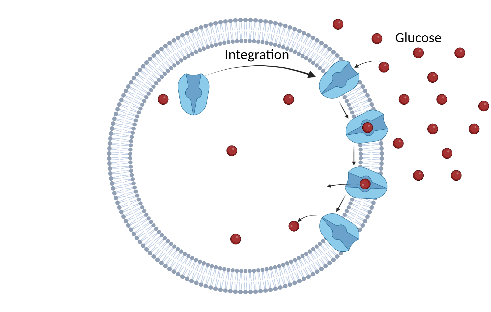
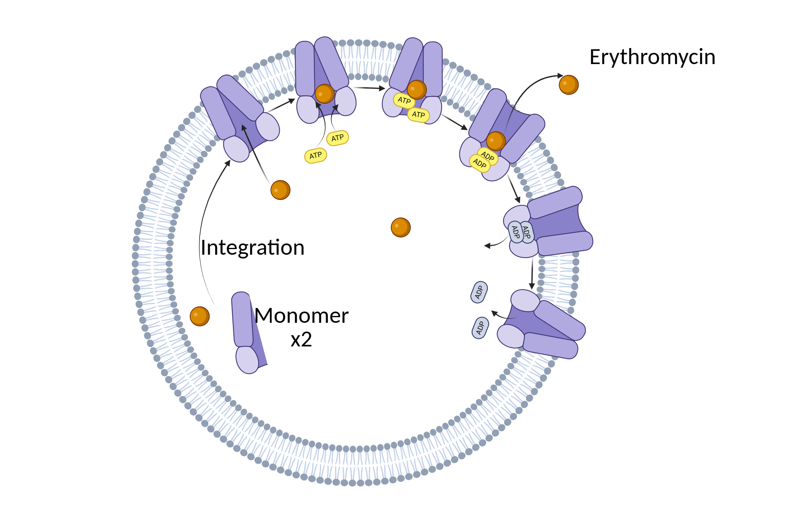
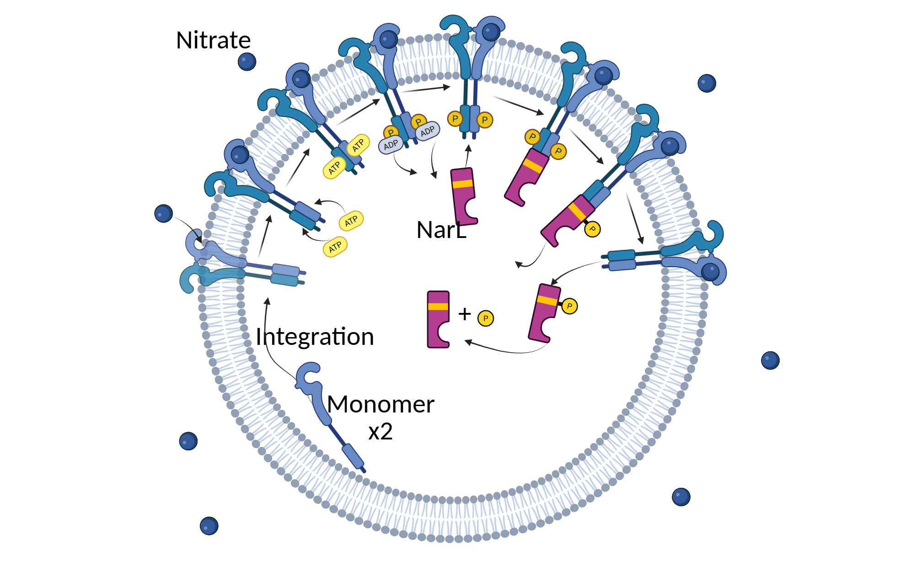

.. currentmodule:: biocrnpyler

.. _membranes_ref:

*********************************************
Membrane-Associated Components and Mechanisms
*********************************************

Introduction
============

BioCRNpyler supports modeling genetic circuits with membrane-associated
features using computational tools. This functionality enables users to
construct and simulate genetic circuits that incorporate membrane
components and mechanisms within simplified cell-free system models.

BioCRNpyler's membrane-associated features allow for the representation of
inducer dynamics, including diffusion across membranes or transport via
channels and transporters. These membrane-associated features facilitate
facilitate the design and refinement of models that connect mechanistic
biology with computational analysis, bridging the gap between conceptual
design and experimental implementation in synthetic biology. The following
provides an overview of the membrane proteins currently included in
BioCRNpyler.

   Membrane components and mechanisms. The figure includes key membrane
   components and the pathways of their mechanisms. The membrane crystal
   structures depicted in the figure were adapted from previously published
   studies: [Song1996]_, [Sun12]_, [Jost18]_, [Cheung09]_. [#f1]_

Membrane Components
-------------------

The following membrane-associated components are available in BioCRNpyler:

- `~components.DiffusibleMolecule`: Represents a molecule that can diffuse
  freely across or within compartments, such as ions, gases, or small polar
  molecules.

- `~components.IntegralMembraneProtein`: Represents a protein embedded
  permanently within the membrane, spanning the lipid bilayer.

- `~components.MembraneChannel`: A subtype of integral membrane protein
  that represents a membrane protein that uses passive or facilitated
  transport to move specific ions or molecules across the membrane via a
  pore.

- `~components.MembranePump`: A subtype of integral membrane protein that
  represents an active transport protein that moves ions or molecules
  against their concentration gradient using energy (e.g., ATP).

- `~components.MembraneSensor`: A subtype of integral membrane protein that
  represents a protein embedded in the membrane that detects environmental
  or intracellular signals (e.g., ligand binding, voltage change) and
  initiates a cellular response, such as activating a signaling cascade.

Membrane Mechanisms
-------------------
The following membrane-associated mechanisms that are available in BioCRNpyler:

- `~mechanisms.Simple_Diffusion`: Models the passive movement of small,
  nonpolar molecules across the membrane, driven by concentration
  gradients, without the need for membrane proteins or energy input.

- Membrane protein-mediated mechanisms:

    - `~mechanisms.Membrane_Protein_Integration`: Models the insertion and
      proper orientation of proteins into the membrane, ensuring their
      structural and functional integration within the lipid bilayer.

    - `~mechanisms.Simple_Transport`: Models the passive movement of
      substrates through membrane pores/channels along concentration
      gradients without requiring energy input.

    - `~mechanisms.Facilitated_Transport_MM`: Models the passive movement
      of substrates along concentration gradients by binding to carrier
      proteins that undergo conformational changes without requiring energy
      input.

    - `~mechanisms.Primary_Active_Transport_MM`: Models the active movement
      of substrates against concentration gradients by binding to membrane
      pumps, which undergo conformational changes driven by energy input
      (e.g., ATP).

    - `~mechanisms.Membrane_Signaling_Pathway_MM`: Models the environmental
      sensing through a signaling pathway involving a sensor kinase and
      phosphorylation of a response regulator protein, enabling adaptive
      cellular responses.

Compiling Chemical Reaction Networks with Membrane Features
-----------------------------------------------------------

The membrane modeling capabilities of BioCRNpyler allow users
to build complex chemical reaction networks (CRNs) involving
membrane-associated components and transport mechanisms from modular,
high-level specifications.

This following figure illustrates the various options available for
modeling transport and two-component signaling within BioCRNpyler. It
specifically highlights the membrane components (orange boxes), their
corresponding mechanisms (green boxes), and species (blue boxes).

   Flowchart illustrating membrane protein features and modeling
   specifications. Specifications include biomolecular components and
   modeling assumptions (mechanisms) relevant to the simulation and
   analysis of membrane- associated processes.

Diffusible Molecules
====================

Component: `~components.DiffusibleMolecule`
-------------------------------------------

A diffusible molecule refers to a class of molecules that can pass through
cell membranes without assistance. Examples of such molecules include gases
like oxygen (O\ :sub:`2`\) and carbon dioxide (CO\ :sub:`2`\), as well as
small polar but uncharged molecules. In contrast, larger uncharged
molecules and charged molecules require membrane proteins for transport
across the membrane.

The following code defines a diffusible molecule called `S`:

.. code-block:: python

    # Define component
    S = DiffusibleMolecule('name')

Unless otherwise specified, the species `S` will reside in the `internal`
compartment. The membrane component `~components.DiffusibleMolecule` will
then create a species `product`, which is a copy of `S` but located in the
`external` compartment.

.. _simple-diffusion:

Mechanism: `~mechanisms.Simple_Diffusion`
-----------------------------------------

Simple diffusion allows molecules to cross membranes passively down their
concentration gradient. Simple diffusion is the most basic mechanism by
which molecules can traverse a membrane, commonly referred to as passive
diffusion. In this process, a molecule can dissolve in the lipid bilayer,
diffuse across it, and reach the other side. This mechanism does not
require the assistance of membrane proteins, and the transport direction is
determined by the concentration gradient, moving from areas of high
concentration to areas of low concentration.

In BioCRNpyler, the `~components.DiffusibleMolecule` component uses the
mechanism `~mechanisms.Simple_Diffusion`, which is defined as follows:

.. code-block:: python

    # Mechanism
    mech_tra = Simple_Diffusion()
    transport_mechanisms = {mech_tra.mechanism_type: mech_tra}

Example 1: Diffusion of nitrate
-------------------------------

Construct a chemical reaction network (CRN) for the diffusion of nitrate
(NO\ :sub:`3`\) across a membrane.

   Simple diffusion across a lipid bilayer.

Consider the following diffusion step for the diffusion of nitrate (NO\
:sub:`3`\).

.. math::

    (\text{NO}_3)_\text{internal} \rightleftharpoons
    (\text{NO}_3)_\text{internal}

To model the example above using the `~components.Diffusible_Molecule`
component and the `~mechanisms.Simple_Diffusion` mechanism, we must first
define the diffusible molecule and then incorporate it into a mixture using
the mechanism to construct a CRN.

.. code-block:: python

    # Define diffusible molecules
    NO3 = DiffusibleMolecule('NO3')

    # Mechanisms
    mech_tra = Simple_Diffusion()
    transport_mechanisms = {mech_tra.mechanism_type: mech_tra}

    # Create mixture
    M0 = Mixture("Diffusible_Molecule", components=[NO3],
                 parameter_file="mechanisms/transport_parameters.tsv",
                 mechanisms=transport_mechanisms)

    # Compile the CRN with Mixture.compile_crn
    CRN = M0.compile_crn()

    # Print the CRN to see what you created
    print(CRN.pretty_print())

Console Output:

.. code-block:: text

    Species(N = 2) = {NO3 (@ 0),  NO3 (@ 0),}

    Reactions (1) = [
    0. NO3 <--> NO3
     Kf=k_forward * NO3_Internal
     Kr=k_reverse * NO3_External
      k_forward=0.0002
      found_key=(mech=simple_diffusion, partid=None, name=k_diff).
      search_key=(mech=simple_diffusion, partid=NO3, name=k_diff).
      k_reverse=0.0002
      found_key=(mech=simple_diffusion, partid=None, name=k_diff).
      search_key=(mech=simple_diffusion, partid=NO3, name=k_diff).

    ]

Integral Membrane Protein
=========================

Component: `~components.IntegralMembraneProtein`
------------------------------------------------

Integral membrane proteins refer to a class of proteins embedded within the
lipid bilayer of cellular membranes. These proteins typically span the
membrane and play essential roles in transport, signaling, and structural
support. Once integrated, they can mediate the movement of other molecules
or relay signals across the membrane.

The following code defines an integral membrane protein component called
`IMP`.  It requires two inputs: `membrane_protein` and `product`, which can
be either strings or `~core.Species` objects.

.. code-block:: python

    # Define component
    IMP = IntegralMembraneProtein(membrane_protein = "MP", product = "P")

Optional arguments may be provided to designate the direction of transport,
define the stoichiometry, and specify the compartment.

.. code-block:: python

    IMP = IntegralMembraneProtein(
        membrane_protein = "MP",
        product = "P",
        direction = None,
        size = None,
        compartment = "Internal",
        membrane_compartment = "Membrane",
        cell = None,
        attributes = None
    )

Key Optional Parameters:

- `direction`: Specifies the transport direction with 'Exporter',
  'Importer', or 'Passive' (default) options. The default value of
  'Passive' indicates that the membrane protein is an integral membrane
  protein. This default may apply to non-transporter proteins or
  unidirectional transporters.  The flux of the substrates, based on the
  `direction`, follows the general transport below.

    - Exporter: :math:`\text{S}_\text{in} \rightarrow \text{S}_\text{out}`
    - Importer: :math:`\text{S}_\text{in} \leftarrow \text{S}_\text{out}`
    - Passive: :math:`\text{S}_\text{in} \leftrightarrow \text{S}_\text{out}`

- `size`: Defines the number of monomers required for the integral membrane
  used in `~mechanisms.Membrane_Protein_Integration` and the subsequent
  reactions. For homo-oligomer membrane proteins, we can include an input
  for `size` as either a numerical string or an integer.

    - If provided: :math:`\text{MP}_\text{monomer} * size \rightarrow
      \text{MP}_\text{oligomer} \rightarrow \text{IMP}`

    - If not: :math:`\text{MP} \rightarrow \text{IMP}`

.. _membrane—protein-integration:

Mechanism: `~mechanisms.Membrane_Protein_Integration`
-----------------------------------------------------

Membrane protein integration refers to the process by which proteins
inserted are proteins are correctly localized and oriented within the
membrane, a crucial step for their function in transport, signaling, or
structural roles. The mechanism does not model active transport or
signaling directly, but it provides the foundational step of embedding
proteins into the membrane, where they can carry out these roles.

The `~components.IntegralMembraneProtein` component uses the
`~mechanisms.Membrane_Protein_Integration` mechanism. The mechanism for
integrating membranes can be implemented and stored in a dictionary.

.. code-block:: python

    # Mechanism
    mech_integration = Membrane_Protein_Integration()
    integration_mechanisms = {mech_integration.mechanism_type: mech_integration}

Example 2: Integration of alpha-hemolysin
-----------------------------------------

Construct a chemical reaction network (CRN) for the membrane integration
steps of alpha-hemolysin.

   Integration of membrane proteins into the lipid bilayer.

Consider the following membrane integration steps for alpha-hemolysin.

1. Assemble into a homoheptamer:

.. math::

    7 \alpha \text{HL}_\text{monomer} \rightarrow \alpha
    \text{HL}_\text{homoheptamer}

2. Integration of membrane protein in the membrane:

.. math::

    \alpha \text{HL}_\text{homoheptamer} \rightarrow \alpha
    \text{HL}_\text{channel}

To model the example above using the `~components.IntegralMembraneProtein`
component and the `~mechanisms.Membrane_Protein_Integration` mechanism, we
must first define the integral membrane protein (e.g., alpha-hemolysin) and
then incorporate it into a mixture using the integration mechanism to
construct a CRN.

.. code-block:: python

    # Define membrane protein
    alphaHL = IntegralMembraneProtein(
        'alphaHL_monomer', product='alphaHL', size = 7)

    # Mechanisms
    mech_integration = Membrane_Protein_Integration()
    integration_mechanisms = {'integration': mech_integration}

    # Create mixture
        M = Mixture("alphaHL", components = [alphaHL_monomer],
                    parameter_file = "mechanisms/transport_parameters.tsv",
                    mechanisms = integration_mechanisms)

    #Compile the CRN and print
        CRN = M.compile_crn()
        print(CRN.pretty_print())

Console Output:

.. code-block:: text

    Species(N = 3) = {
    complex[7x_protein[alphaHL_monomer]] (@ 0),  protein[alphaHL_monomer] (@ 0),  protein[alphaHL(passive)] (@ 0),
    }

    Reactions (2) = [
    0. 7protein[alphaHL_monomer] <--> complex[7x_protein[alphaHL_monomer]]
    Kf=k_forward * protein_alphaHL_monomer_Internal^7
    Kr=k_reverse * complex_protein_alphaHL_monomer_Internal_7x_
    k_forward=0.002
    found_key=(mech=membrane_protein_integration, partid=None, name=kb_oligmor).
    search_key=(mech=membrane_protein_integration, partid=alphaHL_monomer, name=kb_oligmor).
    k_reverse=2e-10
    found_key=(mech=membrane_protein_integration, partid=None, name=ku_oligmor).
    search_key=(mech=membrane_protein_integration, partid=alphaHL_monomer, name=ku_oligmor).

    1. complex[7x_protein[alphaHL_monomer]] --> protein[alphaHL(passive)]
    Kf = k complex[7x_protein[alphaHL_monomer]] / ( 1 + (protein[alphaHL(passive)]/K)^4 )
    k=10.0
    found_key=(mech=membrane_protein_integration, partid=None, name=kex).
    search_key=(mech=membrane_protein_integration, partid=alphaHL_monomer, name=kex).
    K=0.5
    found_key=(mech=membrane_protein_integration, partid=None, name=kcat).
    search_key=(mech=membrane_protein_integration, partid=alphaHL_monomer, name=kcat).
    n=4

    ]

Membrane Channels
=================

Component: `~components.MembraneChannel`
----------------------------------------

Membrane channels refer to a class of proteins, a subclass of integral
membrane proteins, that are pore-forming and create gated pathways across
the lipid bilayer. They allow specific molecules or ions to pass through
the membrane and play key roles in regulated transport, enabling the
movement of substrates in response to concentration gradients or signaling
events.

The following code defines a membrane channel component called `MC`. It
requires two inputs: `integral_membrane_protein` and `substrate`, which can
be either strings or `~core.Species` objects.

.. code-block:: python

    # Define component
    MC = MembraneChannel(integral_membrane_protein = "IMP", substrate = "S")

The component also accepts optional inputs, similar to
`~components.IntegralMembraneProtein`.  However, if the `integral membrane
protein` has already been defined using
`~components.IntegralMembraneProtein`, the `~components.MembraneChannel`
will inherit its `direction` and `compartment` properties from the existing
species (e.g., `IMP`).

The `~components.MembraneChannel` component can utilize the
`~mechanisms.Simple_Transport` or `~mechanisms.Facilitated_Transport_MM`
mechanism. The choice of mechanism depends on the biological behavior of
the channel. You can choose from one of the following options:

- `~mechanisms.Simple_Transport`: Allows bidirectional movement of
  substrates following the concentration gradient. The direction of the
  membrane channel must be set to 'Passive'.

- `~mechanisms.Facilitated_Transport_MM`: Allows the unidirectional
  movement of substrates, also along concentration gradient. The
  `direction` of the membrane channel must be either 'Importer' or
  'Exporter'.

.. _simple-transport:

Mechanism: `~mechanisms.Simple_Transport`
-----------------------------------------

Simple transport models the passive movement of substrates across the
membrane through protein channels or pores. This mechanism enables
molecules to move down their concentration gradient without energy
input. It assumes the channel is always open or allows diffusion based on
molecular properties without involving binding or conformational changes.

The `~mechanisms.Simple_Transport` mechanism involves a one-step reaction
following the resulting reaction is a reversible diffusion-like process:

.. math::

    \text{S}_\text{internal} + \text{MC} \leftrightarrow
    \text{S}_\text{external} + \text{MC}

The mechanism for simple transport can be implemented and stored in a
dictionary.

.. code-block:: python

    # Mechanism
    mech_transport = Simple_Transport()
    transport_mechanisms = {mech_transport.mechanism_type: mech_transport}

Example 3: Simple Transport by alpha-hemolysin
----------------------------------------------

Construct a chemical reaction network (CRN) for the transport of ATP
through alpha-hemolysin.

   Passive transport through membrane pores or channels.

Consider the following reaction of the transport of ATP through the
alpha-hemolysin pore:

.. math::

    \text{ATP}_\text{internal} + \alpha \text{HL}_\text{channel}
    \leftrightarrow \text{ATP}_\text{external}
    + \alpha \text{HL}_\text{channel}

To model the example above using the `~components.Membrane_Channel`
component and the `~mechanisms.Simple_Transport` mechanism, we use the
previously defined integral membrane protein (e.g., alphaHL) represented by
`alphaHL_monomer.product` and incorporate it into a mixture with the
transport mechanism to construct a CRN that enables passive transport
across the membrane.

.. code-block:: python

    # Define membrane channel
    alphaHL_channel = MembraneChannel(alphaHL_monomer.product, substrate ="ATP")

    # Mechanisms
    mech_transport = Simple_Transport()
    transport_mechanisms = {mech_transport.mechanism_type:mech_transport}

    # Create mixture
        M = Mixture("aHL_transport", components = [alphaHL_channel],
                parameter_file = "mechanisms/transport_parameters.tsv",
                mechanisms = transport_mechanisms)

    #Compile the CRN and print
        CRN = M.compile_crn()
        print(CRN.pretty_print())

Console Output:

.. code-block:: text

    Species(N = 3) = {
    protein[alphaHL(passive)] (@ 0),  ATP (@ 0),  ATP (@ 0),
    }

    Reactions (1) = [
    0. ATP+protein[alphaHL(passive)] <--> ATP+protein[alphaHL(passive)]
    Kf=k_forward * ATP_Internal * protein_alphaHL_passive
    Kr=k_reverse * ATP_External * protein_alphaHL_passive
    k_forward=0.1
    k_reverse=0.1

    ]

.. _facilitated-transport:

Mechanism: `~mechanisms.Facilitated_Transport_MM`
-------------------------------------------------

Facilitated transport refers to the movement of substrates across a
membrane with the assistance of specific carrier proteins. These proteins
bind to the substrate and undergo conformational changes, allowing the
molecule to move from one side of the membrane to the other. Although no
energy is required, the process is selective and directional, following the
concentration gradient of the substrate.

The `~mechanisms.Facilitated_Transport_MM` mechanism involves binding,
translocation, and unbinding steps. For example, if the membrane channel is
an 'Importer', the resulting reactions are:

1. Binding and transport of substrate (S) across the membrane:

.. math::

    \text{S}_\text{external} + \text{MC} \rightarrow
    \text{S}_\text{external} \mathord{:} \text{MC}_\text{channel}
    \rightarrow \text{S}_\text{internal} \mathord{:} \text{MC}

2. Unbinding substrate from transporter:

.. math::

    \text{S}_\text{internal} \mathord{:} \text{MC}_\text{channel}
    \rightarrow \text{S}_\text{internal} + \text{MC}_\text{channel}

To use `~mechanisms.Facilitated_Transport_MM`, we need to redefine the membrane
channel to include a transport direction designation, such as 'Importer' or
'Exporter'. For example:

.. code-block:: python

    # Define component
    MC = MembraneChannel(
        integral_membrane_protein = "IMP", substrate = "S",
        direction = 'Importer')

Then, the mechanism for facilitated transport can be implemented and stored
in a dictionary.

.. code-block:: python

    # Mechanism
    mech_transport = Facilitated_Transport()
    transport_mechanisms = {mech_transport.mechanism_type: mech_transport}

Example 4: Facilitated transport of glucose by GLUT1
----------------------------------------------------

Construct a chemical reaction network (CRN) for the transport of glucose
through the membrane channel glucose transporter type 1 (GLUT1).

   Facilitated diffusion via carrier proteins.

Consider the following reactions of the transport of glucose by GLUT1.

1. Integration of membrane protein in the membrane:

.. math::

    \text{GLUT1}_\text{monomer} \rightarrow \text{GLUT1}_\text{channel}

2. Binding and transport of glucose across the membrane:

.. math::

   & \text{glucose}_\text{external} + \text{GLUT1}_\text{channel}
     \rightarrow \text{glucose}_\text{external} \mathord{:}
     \text{GLUT1}_\text{channel} \\
   & \qquad \rightarrow \text{glucose}_\text{internal} \mathord{:}
     \text{GLUT1}_\text{channel}

3. Unbinding glucose from transporter:

.. math::

    \text{glucose}_\text{internal} \mathord{:} \text{GLUT1}_\text{channel}
    \rightarrow \text{glucose}_\text{internal} +
    \text{GLUT1}_\text{channel}

To model the example above using the `~components.MembraneChannel`
component and the `~mechanisms.Facilitated_Transport_MM` mechanism, we can
either redefine the `~components.Membrane_Channel` component or the
integral membrane protein GLUT1 using the
`~components.IntegralMembraneProtein` component to incorporate
directionality.

The following example begins by defining the integral membrane protein,
including the specification of its transport direction.

.. code-block:: python

    # Define integral membrane protein
    glut1 = IntegralMembraneProtein('glut1', product='glut1_channel',
                                    direction='Importer', size= 1)

    # Define membrane channel
    glut1_channel = MembraneChannel(glut1.product, substrate='glucose')

    # Mechanisms
    mech_integration = Membrane_Protein_Integration()
    mech_transport = Facilitated_Transport_MM()

    all_mechanisms = {mech_integration.mechanism_type:mech_integration,
                    mech_transport.mechanism_type:mech_transport}

    # Create mixture
    M = Mixture(components=[glut1, glut1_channel],
        mechanisms=all_mechanisms,
        parameter_file = "mechanisms/transport_parameters.tsv")

    # Compile the CRN and print
    CRN = M.compile_crn()
    print(CRN.pretty_print(show_keys=False))

Console Output:

.. code-block:: text

    Species(N = 6) = {
    protein[glut1_channel(importer)] (@ 0),  protein[glut1] (@ 0),  complex[glucose:protein[glut1_channel]] (@ 0),
    complex[glucose:protein[glut1_channel]] (@ 0),  glucose (@ 0),  glucose (@ 0),
    }

    Reactions (5) = [
    0. protein[glut1] --> protein[glut1_channel(importer)]
    Kf = k protein[glut1] / ( 1 + (protein[glut1_channel(importer)]/K)^4 )
    k=10.0
    K=0.5
    n=4

    1. glucose+protein[glut1_channel(importer)] --> complex[glucose:protein[glut1_channel]]
    kb_subMC*glucose_External*protein_glut1_channel_importer*Heaviside(glucose_External-glucose_Internal)-kb_subMC*glucose_Internal*protein_glut1_channel_importer*Heaviside(glucose_External-glucose_Internal)
    kb_subMC=0.1

    2. complex[glucose:protein[glut1_channel]] --> protein[glut1_channel(importer)]+glucose
    Kf=k_forward * complex_glucose_External_protein_glut1_channel_importer_
    k_forward=0.1

    3. complex[glucose:protein[glut1_channel]] --> complex[glucose:protein[glut1_channel]]
    Kf=k_forward * complex_glucose_External_protein_glut1_channel_importer_
    k_forward=0.01

    4. complex[glucose:protein[glut1_channel]] --> glucose+protein[glut1_channel(importer)]
    Kf=k_forward * complex_glucose_Internal_protein_glut1_channel_importer_
    k_forward=0.1

    ]

Membrane Pumps
==============

Component: `~components.MembranePump`
-------------------------------------

Membrane pumps are a class of transport proteins, also considered a
subclass of integral membrane proteins, that actively move molecules or
ions across the lipid bilayer. Unlike passive channels, pumps use energy,
typically from ATP or an electrochemical gradient, to drive the transport
of substrates against their concentration gradients.

The following code defines a membrane pump component called `MC`. It
requires two inputs: `integral_membrane_protein` and `substrate`, which can
be either strings or `~core.Species` objects.

.. code-block:: python

    # Define component
    MP = MembranePump(membrane_pump = "MP", substrate = "S")

The component also accepts optional inputs, similar to
`~components.IntegralMembraneProtein`.  If the integral membrane protein
was previously defined using the component
`~components.IntegralMembraneProtein`, then the `~components.MembranePump`
will inherit its `direction` and `compartment` properties from the existing
species (e.g., `IMP`).

Additionally, optional arguments can be provided to control the transport
direction, stoichiometry, and compartment.

.. code-block:: python

    MP = MembranePump(membrane_pump = "MP", substrate = "S",
                    direction = None,
                    internal_compartment ='Internal',
                    external_compartment ='External',
                    ATP = None, cell = None, attributes=None)

Key Optional Parameters:

- `ATP`: Specifies the necessary amount of ATP needed for transport to take
  place.  In the absence of a specified integer value for `ATP`, the model
  defaults to a value of 1.

- `direction`: By default, the `direction` is set to `None`, generating a
  CRN corresponding to an exporter.

The `~components.MembranePump` component uses the
`~mechanisms.Primary_Active_Transport_MM` mechanism.

Mechanism: `~mechanisms.Primary_Active_Transport_MM`
----------------------------------------------------

Primary active transport refers to the energy-dependent movement of
substrates across the membrane, typically against their concentration
gradient. This process involves specialized membrane pumps that attach to
the substrate and undergo conformational changes driven by the hydrolysis
of ATP. The transport mechanism is both selective and directional.

The `~mechanisms.Primary_Active_Transport_MM` mechanism captures this
behavior through binding, energy-driven conformational changes, and
unbinding steps. For example, if the membrane pump is classified as an
*exporter*, the resulting reactions are:

1. Binding of antibiotic substrate (S) to membrane pump (MP):

.. math::

    \text{S}_\text{internal} + \text{MP}_\text{exporter} \rightleftharpoons
    \text{S}_\text{internal} \mathord{:} \text{MP}_\text{exporter}

2. Binding of ATP to the complex of S with MP:

.. math::

    \text{ATP}_\text{internal} + \text{S}_\text{internal} \mathord{:}
    \text{MP}_\text{exporter} \rightleftharpoons \text{ATP}_\text{internal}
    \mathord{:} S_\text{internal} \mathord{:} \text{MP}_\text{exporter}

3. Export of S from the internal compartment to the external compartment:

.. math::

    \text{ATP}_\text{internal} \mathord{:} \text{S}_\text{internal}
    \mathord{:} \text{MP}_\text{exporter} \rightarrow
    \text{ATP}_\text{internal} \mathord{:} \text{S}_\text{external}
    \mathord{:} \text{MP}_\text{exporter}

4. Unbinding of S:

.. math::

    \text{ATP}_\text{internal} \mathord{:} \text{S}_\text{external} \mathord{:}
    \text{MP}_\text{exporter} \rightarrow \text{ADP}_\text{internal}
    \mathord{:} \text{MP}_\text{exporter} + \text{S}_\text{external}

5. Unbinding of ADP from MP:

.. math::

    \text{ADP}_\text{internal} \mathord{:} \text{MP}_\text{exporter}
    \rightarrow \text{ADP}_\text{internal} + \text{MP}_\text{exporter}

To use `~mechanisms.Primary_Active_Transport_MM`, we need to redefine the
membrane channel to include a transport direction designation, such as
'Importer' or 'Exporter'.  For example:

.. code-block:: python

    # Define component
    MC = MembraneChannel(integral_membrane_protein = "IMP", substrate = "S",
                         direction = 'Importer')

Then, the mechanism for facilitated transport can be implemented and stored
in a dictionary.

.. code-block:: python

    # Mechanism
    mech_transport = Primary_Active_Transport_MM()
    transport_mechanisms = {mech_transport.mechanism_type: mech_transport}

Example 5: Export of erythromycin by MsbA
-----------------------------------------

Construct a chemical reaction network (CRN) for the export of the
antibiotic erythromycin driven by the membrane pump MsbA.

   Primary active transport using membrane pumps.

Consider the following reactions for the export of erythromycin by MsbA.

1. Integration of membrane protein in the membrane:

.. math::

   \text{MsbA}_\text{homodimer} \rightarrow \text{MsbA}_\text{exporter}

2. Binding of antibiotic (Abx) substrate (e.g., erythromycin) to MsbA
   transporter:

.. math::

   \text{Abx}_\text{internal} + \text{MsbA}_\text{exporter} \leftrightarrow
    \text{Abx}_\text{internal} \mathord{:} \text{MsbA}_\text{exporter}

3. Binding of ATP to a complex of erythromycin with MsbA:

.. math::

    2 \text{ATP}_\text{internal} + \text{Abx}_\text{internal} \mathord{:}
    \text{MsbA}_\text{exporter} \leftrightarrow 2
    \text{ATP}_\text{internal} \mathord{:} \text{Abx}_\text{internal}
    \mathord{:} \text{MsbA}_\text{exporter}

4. Export of erythromycin lipid from inner membrane to outer membrane:

.. math::

    2 \text{ATP}_\text{internal} \mathord{:} \text{Abx}_\text{internal}
    \mathord{:} \text{MsbA}_\text{exporter} \rightarrow 2
    \text{ATP}_\text{internal} \mathord{:} \text{Abx}_\text{external}
    \mathord{:} \text{MsbA}_\text{exporter}

5. Unbinding of erythromycin:

.. math::

   2 \text{ATP}_\text{internal} \mathord{:} \text{Abx}_\text{external}
   \mathord{:} \text{MsbA}_\text{exporter} \rightarrow 2
   \text{ADP}_\text{internal} \mathord{:} \text{MsbA}_\text{exporter} +
   \text{Abx}_\text{external}

6. Unbinding of ADP from MsbA:

.. math::

   2 \text{ADP}_\text{internal} \mathord{:} \text{MsbA}_\text{exporter}
   \rightarrow 2 \text{ADP}_\text{internal} + \text{MsbA}_\text{exporter}

To model the example above using the `~components.MembranePump` component
and the `~mechanisms.Primary_Active_Transport_MM` mechanism, we can either
define the pump directly or specify the integral membrane protein (e.g.,
MsbA) using the `~components.IntegralMembraneProtein` component to
incorporate transport directionality.

The following example begins by defining the integral membrane protein,
including the specification of its direction (e.g., 'Exporter').

.. code-block:: python

    # Define integral membrane protein
    MsbA = IntegralMembraneProtein('MsbA', product='MsbA_pump',
                                    direction='Exporter', size= 2)

    # Define membrane pump
    MsbA_pump = MembranePump(MsbA.product, substrate = 'abx', ATP = 2)

    # Mechanisms
    mech_integration = Membrane_Protein_Integration()
    mech_transport = Membrane_Protein_Integration()

    all_mechanisms = {mech_integration.mechanism_type:mech_integration,
                    mech_transport.mechanism_type:mech_transport}

    # Create mixture
    M = Mixture(components = [MsbA, MsbA_pump,],
        mechanisms = all_mechanisms,
        parameter_file = "mechanisms/transport_parameters.tsv")

    # Compile the CRN and print
    CRN = M.compile_crn()
    print(CRN.pretty_print(show_keys = False))

Console Output:

.. code-block:: text

    Species(N = 11) = {
    complex[protein[MsbA_pump]:2x_small_molecule[ADP]] (@ 0),  complex[2x_protein[MsbA]] (@ 0),  complex[complex[abx:protein[MsbA_pump]]:2x_small_molecule[ATP]] (@ 0),  complex[abx:protein[MsbA_pump]] (@ 0),  complex[abx:protein[MsbA_pump]:2x_small_molecule[ATP]] (@ 0),  abx (@ 0),  abx (@ 0),  protein[MsbA_pump(exporter)] (@ 0),  protein[MsbA] (@ 0),  small_molecule[ATP] (@ 0),  small_molecule[ADP] (@ 0),
    }

    Reactions (9) = [
    0. 2protein[MsbA] <--> complex[2x_protein[MsbA]]
    Kf=k_forward * protein_MsbA_Internal^2
    Kr=k_reverse * complex_protein_MsbA_Internal_2x_
    k_forward=0.002
    k_reverse=2e-10

    1. complex[2x_protein[MsbA]] --> protein[MsbA_pump(exporter)]
    Kf = k complex[2x_protein[MsbA]] / ( 1 + (protein[MsbA_pump(exporter)]/K)^4 )
    k=10.0
    K=0.5
    n=4

    2. abx+protein[MsbA_pump(exporter)] --> complex[abx:protein[MsbA_pump]]
    kb_subMP*abx_Internal*protein_MsbA_pump_exporter*Heaviside(protein_MsbA_pump_exporter)
    kb_subMP=0.1

    3. complex[abx:protein[MsbA_pump]] --> abx+protein[MsbA_pump(exporter)]
    Kf=k_forward * complex_abx_Internal_protein_MsbA_pump_exporter_
    k_forward=0.1

    4. complex[abx:protein[MsbA_pump]]+2small_molecule[ATP] --> complex[complex[abx:protein[MsbA_pump]]:2x_small_molecule[ATP]]
    kb_subMPnATP*complex_abx_Internal_protein_MsbA_pump_exporter_*small_molecule_ATP_Internal*Heaviside(complex_abx_Internal_protein_MsbA_pump_exporter_)
    kb_subMPnATP=0.1

    5. complex[complex[abx:protein[MsbA_pump]]:2x_small_molecule[ATP]] --> complex[abx:protein[MsbA_pump]]+2small_molecule[ATP]
    Kf=k_forward * complex_complex_abx_Internal_protein_MsbA_pump_exporter__small_molecule_ATP_Internal_2x_
    k_forward=0.01

    6. complex[complex[abx:protein[MsbA_pump]]:2x_small_molecule[ATP]] --> complex[abx:protein[MsbA_pump]:2x_small_molecule[ATP]]
    Kf=k_forward * complex_complex_abx_Internal_protein_MsbA_pump_exporter__small_molecule_ATP_Internal_2x_
    k_forward=0.01

    7. complex[abx:protein[MsbA_pump]:2x_small_molecule[ATP]] --> complex[protein[MsbA_pump]:2x_small_molecule[ADP]]+abx
    Kf=k_forward * complex_abx_External_protein_MsbA_pump_exporter_small_molecule_ATP_Internal_2x_
    k_forward=0.1

    8. complex[protein[MsbA_pump]:2x_small_molecule[ADP]] --> 2small_molecule[ADP]+protein[MsbA_pump(exporter)]
    Kf=k_forward * complex_protein_MsbA_pump_exporter_small_molecule_ADP_Internal_2x_
    k_forward=0.1

    ]

Membrane Sensors
================

Component: `~components.MembraneSensor`
---------------------------------------

Membrane sensors are a type of membrane protein classified as a subgroup of
integral membrane proteins. These proteins are designed to detect external
signals or environmental changes at the cell surface.  Typically, these
sensors are part of larger signaling systems, such as two-component
systems. They initiate signal transduction pathways by responding to
specific stimuli, including chemical ligands, changes in osmotic pressure,
or shifts in pH. When activated, membrane sensors often undergo
conformational changes or autophosphorylation, which triggers downstream
responses within the cell.

The following code defines a membrane sensor component called
`~components.MembraneSensor`.  This component requires four inputs:

- `membrane_sensor_protein`: the membrane-bound sensor protein (e.g., a
  histidine kinase)
- `response_protein`: the cytoplasmic response regulator
- `assigned_substrate`: the substrate to which the sensor is assigned or
  responds
- `signal_substrate`: the substrate that acts as the external signal or
  inducer

.. code-block:: python

    # Define component
    Membrane_sensor = MembraneSensor(
        membrane_sensor_protein = "IMP",
        response_protein = "RP",
        assigned_substrate = "S_assigned",
        signal_substrate = "S_signal"
    )

Key Optional Parameters:

- `ATP`: an integer representing the number of ATP molecules required for
  phosphorylation events.  The default value is 2 if not explicitly
  specified.

The `~components.MembraneSensor` component utilizes the
`~mechanisms.Membrane_Signaling_Pathway_MM` mechanism to model
two-component signaling systems, where signal detection at the membrane
results in phosphorylation-driven regulatory responses within the cell.

Mechanism: `~mechanisms.Membrane_Signaling_Pathway_MM`
------------------------------------------------------

The Membrane Signaling Pathway models the two-component signaling process,
allowing cells to detect and respond to external environmental signals
using a membrane-bound sensor kinase and a cytoplasmic response
regulator. This mechanism facilitates signal transduction without the need
for direct substrate transport across the membrane. When the sensor kinase
detects a stimulus, it undergoes autophosphorylation, transferring a
phosphate group to the response regulator. This transfer initiates
downstream cellular responses.

The `~mechanisms.Membrane_Signaling_Pathway_MM` mechanism captures
two-component signaling behavior using Michaelis-Menten kinetics to model
key steps such as stimulus detection, sensor autophosphorylation, and
phosphate transfer to a response regulator. The following reactions
illustrate the signaling pathway modeled by the
`~mechanisms.Membrane_Signaling_Pathway_MM` mechanism. These steps follow
Michaelis-Menten dynamics to represent enzymatic interactions such as
substrate binding, phosphorylation, and dephosphorylation.

1. Signal detection and binding of the signal substrate (S_sig) to the
   membrane sensor (M_sensor):

.. math::

   \text{M}_\text{sensor} + \text{S}_\text{sig} \rightleftharpoons
   \text{M}_\text{sensor} \mathord{:} \text{S}_\text{sig} \equiv
   \text{M}^*_\text{sensor}

2. Auto-phosphorylation of the membrane sensor via ATP binding:

.. math::

    & \text{M}^*_\text{sensor} + 2 \text{ATP}_\text{internal}
    \rightleftharpoons \text{M}^*_\text{sensor} \mathord{:} 2
    \text{ATP}_\text{internal} \\
    & \qquad \rightarrow \text{M}^{*2\text{P}}_\text{sensor} \mathord{:} 2
    \text{ADP}_\text{internal} \rightarrow
    \text{M}^{*2\text{P}}_\text{sensor} + 2 \text{ADP}_\text{internal}

3. Phosphorylation of the response protein (RP):

.. math::

   \text{M}^{*2\text{P}}_\text{sensor} + \text{RP} \rightleftharpoons
   \text{M}^{*2\text{P}}_\text{sensor} \mathord{:} \text{RP} \rightarrow
   \text{M}^*_\text{sensor} \mathord{:} \text{RP}^* \rightarrow
   \text{M}^*_\text{sensor} + \text{RP}^*

4. Dephosphorylation of the phosphorylated response protein (RP*):

.. math::

    RP^* \rightarrow RP + P_i

Then, the mechanism for membrane signaling can be implemented and stored in
a dictionary.

.. code-block:: python

    # Mechanism
	mech_sensor = Membrane_Signaling_Pathway_MM()
	sensor_mechanisms = {mech_sensor.mechanism_type:mech_sensor}

Example 6: NarX-NarL two-component signaling path
-------------------------------------------------

Construct a chemical reaction network (CRN) for the NarX–NarL two-component
signaling pathway.

   Membrane-associated two-componentent signaling pathway.

Use the reaction steps as a guide to define the necessary components and
mechanisms for simulating this signaling cascade.

1. Homodimerization of NarX monomers:

.. math::

    2 \text{NarX}_\text{monomer} \rightarrow \text{NarX}_\text{homodimer}

2. Integration of NarX homodimer into the membrane:

.. math::

    \text{NarX}_\text{homodimer} \rightarrow \text{NarX}_\text{sensor}

3. Detection and binding of nitrate:

.. math::

    \text{NarX}_\text{sensor} + \text{NO}_3 \rightleftharpoons
    \text{NarX}_\text{sensor} \mathord{:} \text{NO}_3 \equiv
    \text{NarX}^*_\text{sensor}

4. Auto-phosphorylation of activated NarX sensor:

.. math::

   & \text{NarX}^*_\text{sensor} + 2 ATP_\text{internal} \rightleftharpoons
   \text{NarX}^*_\text{sensor} \mathord{:} 2 ATP_\text{internal} \\
   & \qquad \rightarrow \text{NarX}^{*2\text{P}}_\text{sensor} \mathord{:} 2
   \text{ADP}_\text{internal} \rightarrow
   \text{NarX}^{*2\text{P}}_\text{sensor} + 2 \text{ADP}_\text{internal}

5. Phosphorylation of the response regulator NarL:

.. math::

   \text{NarX}^{*2\text{P}}_\text{sensor} + \text{NarL} \rightleftharpoons
   \text{NarX}^{*2\text{P}}_\text{sensor} \mathord{:} \text{NarL}
   \rightarrow \text{NarX}^*_\text{sensor} \mathord{:} \text{NarL}^*
   \rightarrow \text{NarX}^*_\text{sensor} + \text{NarL}^*

6. Dephosphorylation of phosphorylated NarL (NarL\*):

.. math::

   \text{NarL}^* \rightarrow \text{NarL} + \text{P}_i

To model the example above using the `~components.MembraneSensor` component
and the `~mechanisms.Membrane_Signaling_Pathway_MM` mechanism, we can begin
by defining a new integral membrane protein (e.g., NarX) using the
`~components.IntegralMembraneProtein` component. This protein will serve as
the membrane-bound sensor in the signaling pathway.

The following example begins by defining the integral membrane protein,
followed by the membrane sensor. Both components are combined to form a
mixture, which includes the response regulator and relevant signaling
substrates.

.. code-block:: python

    # Define integral membrane protein
    NarX = IntegralMembraneProtein('NarX', product='NarX_sensor',
                                size = 2)

    # Define membrane sensor
    NarX_sensor = MembraneSensor(
        NarX.product, response_protein = 'NarL',
        assigned_substrate = 'P', signal_substrate = 'NO3', ATP = 2)

    # Mechanisms
    mech_integration = Membrane_Protein_Integration()
    mech_sensing = Membrane_Signaling_Pathway_MM()

    all_mechanisms = {mech_integration.mechanism_type:mech_integration,
                    mech_sensing.mechanism_type:mech_sensing}

    # Create mixture
    M = Mixture(
        components = [NarX, NarX_sensor],
        mechanisms = all_mechanisms,
        parameter_file = "mechanisms/transport_parameters.tsv")

    #Compile the CRN and print
    CRN = E.compile_crn()
    print(CRN.pretty_print(show_keys = False))

Console Output:

.. code-block:: text

    Species(N = 15) = {
    complex[2x_protein[NarX]] (@ 0),  complex[complex[NO3:protein[NarX_sensor]]:2x_small_molecule[ATP]] (@ 0),  complex[P:complex[NO3:protein[NarX_sensor]]:2x_small_molecule[ADP]] (@ 0),  complex[P:complex[NO3:protein[NarX_sensor]]] (@ 0),  P (@ 0),  protein[NarX_sensor(passive)] (@ 0),  protein[NarX] (@ 0),  NarLactive (@ 0),  complex[NarL:complex[P:complex[NO3:protein[NarX_sensor]]]] (@ 0),  complex[NarL:P:complex[NO3:protein[NarX_sensor]]] (@ 0),  NarL (@ 0),  complex[NO3:protein[NarX_sensor]] (@ 0),  NO3 (@ 0),  small_molecule[ATP] (@ 0),  small_molecule[ADP] (@ 0),
    }

    Reactions (10) = [
    0. 2protein[NarX] <--> complex[2x_protein[NarX]]
    Kf=k_forward * protein_NarX_Internal^2
    Kr=k_reverse * complex_protein_NarX_Internal_2x_
    k_forward=0.002
    k_reverse=2e-10

    1. complex[2x_protein[NarX]] --> protein[NarX_sensor(passive)]
    Kf = k complex[2x_protein[NarX]] / ( 1 + (protein[NarX_sensor(passive)]/K)^4 )
    k=10.0
    K=0.5
    n=4

    2. NO3+protein[NarX_sensor(passive)] <--> complex[NO3:protein[NarX_sensor]]
    Kf=k_forward * NO3_Internal * protein_NarX_sensor_passive
    Kr=k_reverse * complex_NO3_Internal_protein_NarX_sensor_passive_
    k_forward=0.002
    k_reverse=2e-10

    3. complex[NO3:protein[NarX_sensor]]+2small_molecule[ATP] <--> complex[complex[NO3:protein[NarX_sensor]]:2x_small_molecule[ATP]]
    Kf=k_forward * complex_NO3_Internal_protein_NarX_sensor_passive_ * small_molecule_ATP_Internal^2
    Kr=k_reverse * complex_complex_NO3_Internal_protein_NarX_sensor_passive__small_molecule_ATP_Internal_2x_
    k_forward=0.002
    k_reverse=2e-10

    4. complex[complex[NO3:protein[NarX_sensor]]:2x_small_molecule[ATP]] --> complex[P:complex[NO3:protein[NarX_sensor]]:2x_small_molecule[ADP]]
    Kf=k_forward * complex_complex_NO3_Internal_protein_NarX_sensor_passive__small_molecule_ATP_Internal_2x_
    k_forward=0.1

    5. complex[P:complex[NO3:protein[NarX_sensor]]:2x_small_molecule[ADP]] --> complex[P:complex[NO3:protein[NarX_sensor]]]+2small_molecule[ADP]
    Kf=k_forward * complex_P_Internal_complex_NO3_Internal_protein_NarX_sensor_passive__small_molecule_ADP_Internal_2x_
    k_forward=0.8

    6. complex[P:complex[NO3:protein[NarX_sensor]]]+NarL <--> complex[NarL:complex[P:complex[NO3:protein[NarX_sensor]]]]
    Kf=k_forward * complex_P_Internal_complex_NO3_Internal_protein_NarX_sensor_passive__ * NarL_Internal
    Kr=k_reverse * complex_NarL_Internal_complex_P_Internal_complex_NO3_Internal_protein_NarX_sensor_passive___
    k_forward=0.002
    k_reverse=1e-10

    7. complex[NarL:complex[P:complex[NO3:protein[NarX_sensor]]]] --> complex[NarL:P:complex[NO3:protein[NarX_sensor]]]
    Kf=k_forward * complex_NarL_Internal_complex_P_Internal_complex_NO3_Internal_protein_NarX_sensor_passive___
    k_forward=0.1

    8. complex[NarL:P:complex[NO3:protein[NarX_sensor]]] --> NarLactive+complex[NO3:protein[NarX_sensor]]
    Kf=k_forward * complex_NarL_Internal_P_Internal_complex_NO3_Internal_protein_NarX_sensor_passive__
    k_forward=0.2

    9. NarLactive --> NarL+P
    Kf=k_forward * NarLactive_Internal
    k_forward=2e-10

    ]

References
==========

.. [Song1996] L.Song et al., *Structure of Staphylococcal Alpha-Hemolysin,
   a Heptameric Transmembrane Pore*. Science , 1996.

.. [Sun12] L. Sun et al., *Crystal structure of a bacterial homologue of
   glucose transporters GLUT1-4*. Nature, 2012.

.. [Jost18] I. Josts et al., *Conformational States of ABC Transporter MsbA
   in a Lipid Environment Investigated by Small-Angle Scattering Using
   Stealth Carrier Nanodiscs*. Structure, 2018.

.. [Cheung09] J. Cheung and W. A. Hendrickson, *Structural analysis of
   ligand stimulation of the histidine kinase NarX*. Structure, 2009.

.. rubric:: Footnotes

.. [#f1] Figures created with `BioRender.com <https://www.biorender.com>`__
